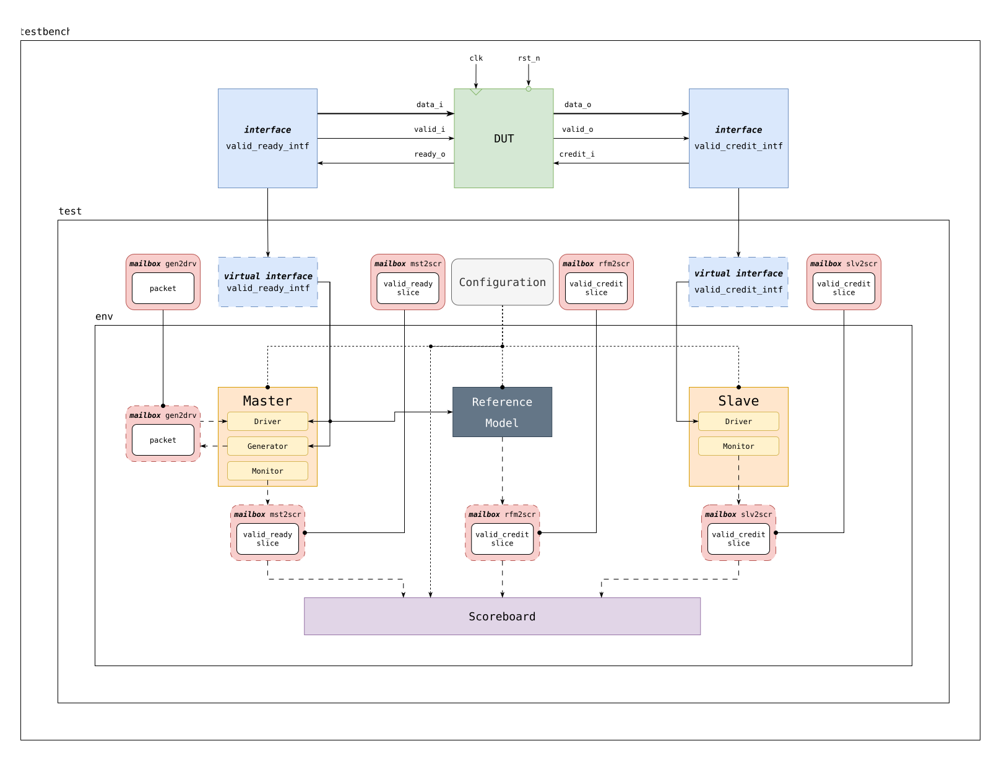

# Adapter Verification
Black-box формальная и функциональная верификация переходника с интерфейса valid-ready на интерфейс valid-credit. Этот проект является решением двух домашних работ курса "Верификация систем на кристалле".

## Структура репозитория

1. `doc/` - документация на тестируемый модуль.
2. `formal/` - исходники формальной части верификации.
3. `functional/` - исходники функциональной части верификации.

## Верификация на основе симуляции

### Задание:

- Переписать текущий тестбенч adapter_tb со следующими требованиями
Должны написать минимум 5 тестов: случайных или направленных, полностью проверяющих adapter.
- Каждый тест наследуется от Test
- Test соединяется с модулем adapter через виртуальный интерфейс
- В тестбенче должен быть сформирован массив из созданных тестов, они должны быть запущены в случайном порядке.
- В тестбенче должены быть написаны SVA на протокол работы adapter.
- В тестбенче или тесте должно быть написано функциональное покрытие для adapter.
- В тестбенче можно оставить логику работы с clk и rst_n.
- В конце должен быть напечатан список тестов со статусом прохождения и «All tests passed» в случае полного успешного прохождения всех тестов, иначе «Some tests failed».

### Файловая структура: 

```
📌
├── 📂 functional/
    ├── 📂 src/adapter/
    │   ├── 📂 env/
    │   │   ├── 📂 agents/
    │   │   │   ├── 📂 master/
    │   │   │   │   ├── 📟 master_driver.sv
    │   │   │   │   ├── 📟 master_monitor.sv
    │   │   │   │   ├── 📟 master_generator.sv
    │   │   │   │   └── 📟 master.sv
    │   │   │   └── 📂 slave/
    │   │   │       ├── 📟 slave_driver.sv
    │   │   │       ├── 📟 slave_monitor.sv
    │   │   │       └── 📟 slave.sv
    │   │   ├── 📟 env.sv
    │   │   ├── 📟 reference_model.sv
    │   │   └── 📟 scoreboard.sv
    │   ├── 📂 intefaces/
    │   │   ├── 📟 valid_credit_intf.sv
    │   │   └── 📟 valid_ready_intf.sv
    │   ├── 📂 items/
    │   │   ├── 📟 packet.sv
    │   │   ├── 📟 valid_credit_slice.sv
    │   │   └── 📟 valid_ready_slice.sv
    │   ├── 📂 test/
    │   │   ├── 📂 scenarios/
    │   │   │   ├── 📟 test_exhaustion.sv
    │   │   │   ├── 📟 test_intensive.sv
    │   │   │   ├── 📟 test_normal.sv
    │   │   │   ├── 📟 test_overflow.sv
    │   │   │   └── 📟 test_overwhelmed.sv
    │   │   ├── 📟 test_config.sv
    │   │   └── 📟 test.sv
    │   ├── 📟 adapter_tb.sv
    │   ├── 📟 adapter.sv
    │   ├── 😫 sim_main.cpp
    │   └── 📟test_pkg.sv
    ├── 🔧 Makefile
    └── 📄 results.txt
```

### Описание окружения

Верификационная среда `env` имеет стандартную структуру:

* `class master` представляет собой устройство-отправитель, работающее по протоколу valid-ready.

    * `class master_generator` генерирует рандомизированные тестовые воздействия; constraints же к ним задает test.

    * `class master_driver` драйвит сгенерированные данные, полученные от generator'а на порты виртуального интерфейса valid-ready.

    * `class master_monitor` каждый такт времени делает "срез" портов интерфейса valid-ready и отправляет их на scoreboard.

* `class slave` представляет собой устройство-получатель, работающее по протоколу valid-credit. Имеет встроенный счетчик кредитов и эмулирует работу обработчика данных, поэтому выдает кредиты с некоторой задержкой.

    * `class slave_driver` драйвит на входной порт интерфейса valid-credit кредит при наличии их у slave'а.

    * `class slave_monitor` каждый такт времени делает "срез" портов интерфейса valid-credit и отправляет их на scoreboard.

* `class reference_model` является эталонной моделью переходника (или «переходника» — возможно, имеется в виду адаптера или преобразователя протоколов, но слово оставлено как есть).

* `class scoreboard` сравнивает результаты тестируемого модуля с результатами эталонной модели.

`class test` является родительским для всех тестовых сценариев. Он занимается конфигурированием всех элементов верификационного окружения. Содержит специальную виртуальную функцию `config_gen()`, в которой находится констрейнт рандомизации тестового сценария. Поэтому для добавления нового тестового сценария достаточно наследоваться от `test` и переопределить эту функцию, изменив констрейнт.

`class adapter_tb` объединяет тестовые сценарии и DUT. Взаимодействие между ними осуществляется посредством интерфейсов `valid_ready_intf` и `valid_credit_intf`.




## Формальную верификация

### Задание:

Необходимо формально проверить, что тестируемый модуль полностью соответствует спецификации

На входе нам, как верификаторам, доступна документация на модуль (`doc/adapter.md`), в которой описана теория работы модуля (которую мы, как верификаторы, должны понимать, чтобы осознанно и корректно тестировать модуль), а также описаны свойства схемы, которые являются ключевыми (например, эти свойства просил заказчик разработки данного модуля)

Для формальной верификации вам предлагается перевести данные свойства с русского языка на язык SVA, сделать это необходимо в файле `src/adapter_sva.sv`, который не содержит ничего, кроме будущих шести SVA (`h0`-`h5`). В идеальных условиях, мы,
как верификаторы, не должны видеть RTL-код, поэтому весь RTL-код модуля вынесен в отдельный файл: нам доступна документация на интерфейс, и поэтому все SVA мы должны описывать, используя известные имена портов — никаких внутренних сигналов модуля мы не можем использовать, так как микроархитектура модуля для нас "недоступна"

В файле `src/adapter_sva.sv` уже содержится пример для свойства h0, который поможет разобраться с синтаксисом

Сначала нужно добиться того, что `main` тест проходит полностью успешно, а дальше проверять с помощью остальных `h` тестов, что при ("скрытой" от вас) поломке RTL в известном месте каждый соответствующий тест ожидаемо падает (значит ваш SVA детектирует невыполнение свойства модулем). Например, для свойства `h0` написан корректный SVA, на тесте `main` это свойство будет PASS, так как RTL написан корректно и наш SVA проверяет данное свойство; но в специальном тесте `h0` в RTL вносится ошибка в месте выдачи `valid_o`, и наш корректный SVA в тесте `h0` должен стать FAIL, так как RTL больше не обеспечивает требуемое свойство.

| идентификатор | описание |
| -- | -- |
| h0 | преобразователь не может произвольно установить valid_o, если нет valid_i |
| h1 | преобразователь сохраняет корректность данных при передаче, если установлен valid_o |
| h2 | если преобразователь установил ready_o, то при наличии valid_i передача данных гарантировано происходит |
| h3 | если преобразователь получает кредит, то при наличии valid_i он обязан им воспользовать для передачи данных |
| h4 | если в прошлом такте был получен кредит, и им не воспользовались, то в текущем такте, даже если нет входящего кредита, при наличии valid_i преобразователь обязан передать данные |
| h5 | количество кредитов в системе меньше или равно двум |

### Файловая структура:

```
📌
├── 📂 formal/
    ├── 📂 src/
    │   └── 📟 adapter_sva.sv
    ├── 📂 tests/
    │   ├── 📂 h0/
    │   │   ├── 💡 adapter.sby
    │   │   └── 📟 adapter.sv
    │   ├── 📂 h1/
    │   │   ├── 💡 adapter.sby
    │   │   └── 📟 adapter.sv
    │   ├── 📂 h2/
    │   │   ├── 💡 adapter.sby
    │   │   └── 📟 adapter.sv
    │   ├── 📂 h3/
    │   │   ├── 💡 adapter.sby
    │   │   └── 📟 adapter.sv
    │   ├── 📂 h4/
    │   │   ├── 💡 adapter.sby
    │   │   └── 📟 adapter.sv
    │   └── 📂 h5/
    │       ├── 💡 adapter.sby
    │       └── 📟 adapter.sv
    ├── 📊 formal.robot
    └── 🔧 Makefile
```

## Решение

SystemVerilog Assertions были написаны в стиле immediate assertions для SymbiYosys и concurrent assertions для себя, чтобы поупражняться, поэтому они были закомментированы. Использовался алгоритм Bounded Model Checking со стандартной глубиной (выбранным тулом по умолчанию).